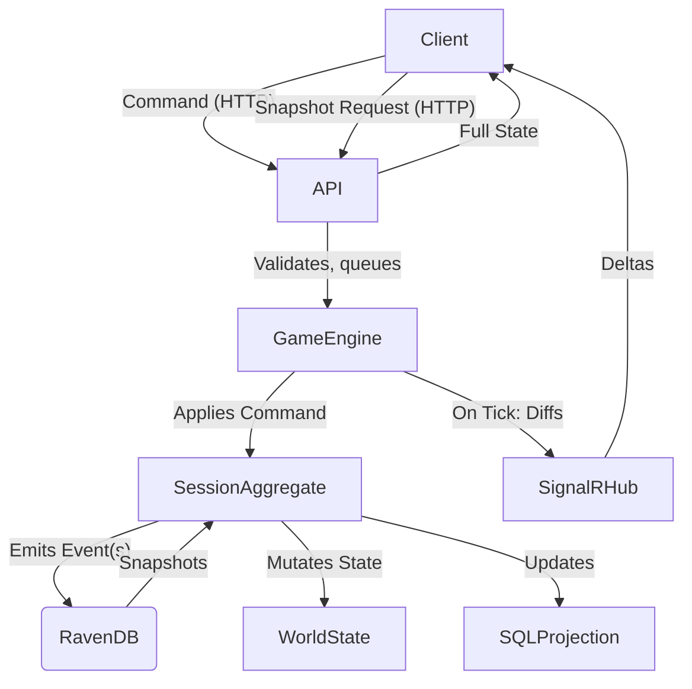

Your thinking is spot-on and aligns with best practices in modern game backend/event sourcing architectures. Let's clarify and design the **datastore and eventing model** for your game, addressing:

- **Command vs. Event** terminology and flow
- SQL vs. Event Sourcing (RavenDB) for world state
- Tick-based diff publishing and snapshotting
- How to support both aggregate calculations (like faction-wide fuel costs) and replayability

---

## 1. **Terminology & Flow**

- **Command:**  
  - Sent from client to server (via HTTP).
  - Represents an *intent* ("MoveFleet", "BuildStructure", etc.).
  - Validated and processed by the backend.
- **Event:**  
  - Emitted by the backend as a result of a command (or AI, or timer).
  - Represents a *fact* ("FleetMoved", "StructureBuilt", etc.).
  - Persisted (event store), and broadcast to clients (SignalR).
- **Tick:**  
  - The server's simulation step (could be real-time or turn-based).
  - At each tick, all pending commands are processed, events are generated, world state is mutated, and diffs are published.

---

## 2. **Datastore Model: SQL vs. Event Sourcing**

### **Option A: SQL as Source of Truth**
- **Pros:**  
  - Easy to query for aggregates (e.g., total fuel, player stats).
  - Familiar to most devs.
- **Cons:**  
  - Harder to support full replay, audit, or rollback.
  - Snapshots and deltas must be managed manually.

### **Option B: Event Sourcing (RavenDB) as Source of Truth**
- **Pros:**  
  - Every change is an event; full replay and audit trail.
  - Snapshots are just serialized aggregates.
  - Deltas are natural (event stream).
- **Cons:**  
  - Aggregate queries (e.g., total fuel) require replaying events or maintaining projections/read models.
  - More complex to query arbitrary state unless you maintain projections.

### **Hybrid (Recommended)**
- **Event Sourcing (RavenDB)** for all game-changing events and snapshots.
- **SQL** for projections/read models (e.g., leaderboards, stats, aggregate values) and for non-gameplay data (accounts, auth, etc.).
- On each tick, update SQL projections as needed for fast queries.

---

## 3. **Tick, Diff, and Snapshot Model**

- **Tick:**  
  - At each tick, process all queued commands, apply resulting events to the world aggregate.
  - After applying, compute the diff (delta) from previous state.
  - Broadcast the diff to all clients in the session group.
- **Snapshot:**  
  - Every N ticks or on demand, serialize the full world state and store as a snapshot in RavenDB.
  - If a client falls behind, it can request the latest snapshot + events since snapshot.
- **Full State:**  
  - Only sent on initial join, or if a client requests it (e.g., after missing too many diffs).

---

## 4. **Aggregate Calculations (e.g., Faction-wide Fuel Costs)**

- **Option 1:**  
  - Calculate on-the-fly by replaying events (slow for large histories).
- **Option 2 (Recommended):**  
  - Maintain a **read model/projection** in SQL or in-memory, updated on each event/tick.
  - This model is updated as part of the event application pipeline, so it's always current and fast to query.

---

## 5. **Proposed Architecture Diagram**

---

## 6. **Actionable Steps**

1. **Document this model** in a new design doc (`DesignDocs/DatastoreAndEventing.md`).
2. **Implement**:
   - Command handler pipeline (HTTP → queue → tick)
   - Event sourcing with RavenDB (events, snapshots)
   - Read model/projection updater (for SQL)
   - Tick-based diff computation and SignalR broadcasting
   - Snapshot/restore logic for clients

---

**Would you like me to create the new design doc (`DatastoreAndEventing.md`) with this model, or do you want to discuss/adjust any part of the above first?**