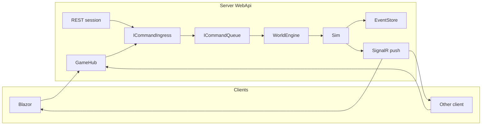

# Architecture — Client-agnostic game backend

## Command vs Event

- **Command** = player intent (request). Clients send commands; they are not stored as facts.
- **Event** = what actually happened (fact), produced by the sim and persisted.

Commands and events are separate types. The simulation validates commands and emits events; only events are written to the event store.

## Pipeline

1. **Ingress** — `ICommandIngress.SubmitAsync(sessionId, command)`. Fast validation only; enqueue or throw.
2. **Queue** — `ICommandQueue`: Channel-based, single reader (engine). `DrainAsync` returns all commands available at tick boundary.
3. **Engine** — `WorldEngine.TickAsync(tick)`: drain commands, group by session, run sim per command, apply resulting events to world, persist events, push deltas via SignalR.

## Single process

All of the above run in `StarConflictsRevolt.Server.WebApi`. There is no separate EngineWorker process. The tick loop (GameTickService) publishes ticks; GameTickMessageFlow calls AI then GameUpdateService; GameUpdateService delegates to WorldEngine for the new pipeline and still processes the legacy command queue for backward compatibility.

## Event store and snapshots

- **RavenEventStore**: Persists `EventEnvelope(WorldId, IGameEvent, Timestamp)`. Only event types (e.g. FleetOrderAccepted, CommandRejected) are stored, not commands.
- **Snapshots**: Periodic world snapshots (e.g. every N events) for faster catch-up.
- **EventBroadcastService**: Subscribes to the event store and pushes updates to SignalR groups (per world/session).

## Transport

- **SignalR**
  - **WorldHub** (`/gamehub`): JoinWorld(worldId), full world and deltas.
  - **GameHub** (`/commandhub`): Command methods (MoveFleet, QueueBuild, StartRally, StartMartialLaw) that call ICommandIngress.
- **REST**: Session lifecycle (create, join, get state). Optional REST command endpoints that submit via ICommandIngress.

## Client model

Authoritative-only: client sends command; UI waits for resulting event(s) (deltas or event stream). Optimistic UI can be added later.
