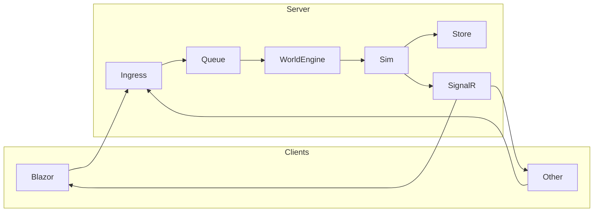

# Architecture

Single process: clients send **commands**; **Ingress → Queue → Engine** runs the sim, persists **events**, pushes deltas via SignalR. Terms: [glossary.md](glossary.md). Narrative: [../story.md](../story.md). Code map: [../operations/development.md](../operations/development.md).

**Simulation vs Domain:** **StarConflictsRevolt.Server.Simulation** contains only the tick/engine layer (GameTickService, ITickPublisher, ITickListener, ICommandQueue, GameTickMessage). It has no domain models. **StarConflictsRevolt.Server.Domain** is the single source of truth for all domain types (World, Galaxy, Fleet, Planet, Commands, Events, AI, Combat, etc.) and the sim execution (IGameSim, GameSim). The WebApi project must not define its own domain or “Core/Domain” — it uses Server.Domain only. Command/event contracts (IGameCommand, IGameEvent) live in **StarConflictsRevolt.Server.EventStorage.Abstractions**.

## Blazor frontend (not Hybrid)

The Blazor app is a **web frontend** that depends on the backend; it is **not** Blazor Hybrid (no native WPF/MAUI host).

| What we use | Meaning |
|-------------|--------|
| **Blazor Web App** | ASP.NET Core app that serves the UI. |
| **Interactive Server** | Interactive components run on the server; the browser gets HTML and a SignalR connection. Clicks and form posts are sent to the Blazor host, which updates the UI and calls the Web API. |
| **Not Hybrid** | Hybrid = Blazor inside a native app (e.g. WPF). We use the web hosting model only. |

**Flow:** Browser ↔ **Blazor host (frontend)** ↔ **Web API (backend)**. The Blazor host uses `HttpClient` to call the API (sessions, delete, game actions) and SignalR to receive real-time updates. The frontend is not independent—all data and commands go through the API.

## Player tracking (single-player resume)

To avoid generating a new world every time a player opens Single Player, the app tracks the player and resumes their existing session when possible.

| Layer | Behaviour |
|-------|-----------|
| **Client** | A persistent **client id** is stored in the browser (`localStorage` key `StarConflictsRevolt.PlayerId`). It is generated once (UUID) and sent with `POST /game/session` in the request body as `ClientId`. |
| **API** | `POST /game/session` accepts optional `ClientId`. For **SinglePlayer** + non-empty `ClientId`: the server looks up an active single-player session for that client; if one exists, it returns that session and its world (no new world). Otherwise it creates a new session, sets `Session.ClientId`, creates the world, and returns 201. |
| **DB** | `Session` has optional `ClientId`. `GetActiveSessionsAsync(clientId)` returns active sessions for that client; the handler filters by `SessionType.SinglePlayer` and picks the most recent. |

So the same browser/device gets the same single-player world on subsequent “Single Player” visits until that session is ended (or the server restarts and the in-memory world is lost; persistence of world state is separate).

## Command vs event

| | Command | Event |
|---|--------|--------|
| **What** | Player intent (request) | What happened (fact) |
| **Source** | Clients (hub/REST) | Simulation |
| **Stored** | No | Yes (event store) |

Sim validates commands and emits events; only events are persisted.

## Pipeline

| Step | What |
|------|------|
| **Ingress** | `ICommandIngress.SubmitAsync(sessionId, command)` — validate, enqueue. |
| **Queue** | `ICommandQueue` (channel). Engine drains at tick boundary (`DrainAsync`). |
| **Engine** | `WorldEngine.TickAsync`: drain → group by session → sim per command → apply events → persist → push deltas. |

All in `StarConflictsRevolt.Server.WebApi`. No separate worker. GameTickService publishes ticks → Transport (TickTransport) → listeners (AiTurnService, GameUpdateService); GameUpdateService calls WorldEngine.TickAsync (which drains ICommandQueue) then processes the legacy per-session CommandQueue. See [Queues](#queues-that-must-exist) below.

## Queues that must exist

The pipeline depends on **three** queue/channel mechanisms. All must be registered and wired at startup.

### 1. Command queue (ICommandQueue) — channel-based

| Role | Purpose |
|------|--------|
| **Contract** | `ICommandQueue` (Simulation): `TryEnqueue(sessionId, command)`, `DrainAsync(ct)`. |
| **Implementation** | `CommandQueueChannel` — a single **unbounded** `Channel<QueuedCommand>` with **SingleReader = true**, **SingleWriter = false**. |
| **Writers** | **CommandIngress** (hub and REST submit via `SubmitAsync`), **AiTurnService** (AI-generated commands). Multiple writers are safe. |
| **Reader** | **WorldEngine.TickAsync** — the only consumer; it calls `DrainAsync` at each tick and groups by session, then runs the sim and persists events. |
| **Must exist** | Yes. Without it, no player or AI commands reach the engine. Registered as singleton `ICommandQueue` → `CommandQueueChannel`. |

This is the **main** command path: Ingress → channel → engine at tick boundary. Order is preserved per tick drain; no per-session queues here.

### 2. Legacy per-session command queue (CommandQueue)

| Role | Purpose |
|------|--------|
| **Type** | `CommandQueue` — a **ConcurrentDictionary&lt;GameSessionId, ConcurrentQueue&lt;GameCommandMessage&gt;&gt;** (one queue per session). |
| **Writers** | **GameActionEndpointHandler** (REST: move-fleet, etc.) — enqueues with `Enqueue(sessionId, command)`. |
| **Reader** | **GameUpdateService.ProcessAllSessionsAsync** — after `WorldEngine.TickAsync`, iterates active sessions and calls `TryDequeue(sessionId, out msg)` in a loop until empty, then applies and pushes deltas. |
| **Must exist** | Yes, while REST game-action endpoints use it. Registered as singleton `CommandQueue`. |

This path exists in parallel to the channel: REST handlers can push into this per-session queue, and the same tick flow (GameUpdateService) drains it per session. Unifying both into a single queue (e.g. all commands via ICommandQueue) is a possible future refactor.

### 3. Event store internal channel (RavenEventStore)

| Role | Purpose |
|------|--------|
| **Type** | **Bounded** `Channel<EventEnvelope>` inside **RavenEventStore** (capacity configurable, default 1000). **SingleReader** (ProcessLoop), **SingleWriter = false** (PublishAsync from many callers). **FullMode = Wait** so publishers block when full. |
| **Writers** | **WorldEngine** (and any code that calls `IEventStore.PublishAsync(worldId, event)`). |
| **Reader** | **ProcessLoop** — one background task: read envelope → persist to RavenDB → dispatch to subscribers (e.g. EventBroadcastService). |
| **Must exist** | Yes. Event store implementation creates it; without it, events are not persisted or broadcast. |

So: **ICommandQueue** (channel) + **CommandQueue** (per-session) + **event store channel** are the three queues that must exist and be connected for commands to be processed and events to be stored and pushed to clients.

## Tick loop (10/s)

| Step | What |
|------|------|
| 1 | **GameTickService** publishes `GameTickMessage` (~100 ms) via PulseFlow. |
| 2 | **GameTickMessageFlow** runs AiTurnService, then GameUpdateService. |
| 3 | **GameUpdateService** calls WorldEngine.TickAsync, then legacy queue per session. |
| 4 | **WorldEngine.TickAsync**: (a) **Command phase** — drain queue, sim per command, apply events (e.g. FleetOrderAccepted), persist, push deltas; (b) **Time advancement** — for each session, fleets with `EtaTick ≤ currentTick` get FleetArrived applied, persist, push deltas. |

Clients get **ReceiveUpdates** on WorldHub (session group). Time advances even with no commands (e.g. fleets arrive).

**Target design:** A dedicated **Transport** layer will fan out ticks to in-process listeners and SignalR from a single publish; Simulation stays decoupled. See [transport-layer-spec.md](transport-layer-spec.md).

## Event types (world state)

| Event | When | Effect |
|-------|------|--------|
| FleetOrderAccepted | MoveFleet valid | Fleet → destination planet, Status=Moving, EtaTick set |
| FleetArrived | tick ≥ EtaTick | Fleet Status=Idle, location set, transit cleared |
| CommandRejected | Command invalid | Logged only |
| BuildStructureEvent | Build (legacy) | Structure on planet |
| AttackEvent | Attack (legacy) | Combat result applied |

## Event store & transport

- **RavenEventStore**: `EventEnvelope(WorldId, IGameEvent, Timestamp)`. Snapshots every N events. **EventBroadcastService** subscribes and pushes to SignalR groups.
- **WorldHub** (`/gamehub`): JoinWorld(worldId); server pushes ReceiveUpdates (deltas).
- **GameHub** (`/commandhub`): MoveFleet, QueueBuild, StartRally, StartMartialLaw → ICommandIngress. REST: [api-transport.md](api-transport.md).

**Client:** Authoritative. JoinWorld → ReceiveUpdates; send commands via hub or REST → deltas on next tick(s).
