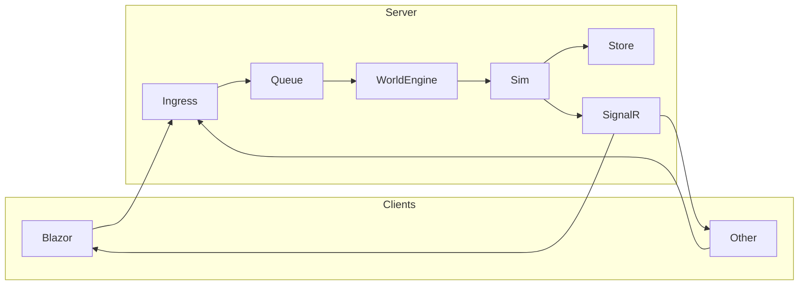

# Architecture

Single process: clients send **commands**; **Ingress → Queue → Engine** runs the sim, persists **events**, pushes deltas via SignalR. Terms: [glossary.md](glossary.md). Narrative: [../story.md](../story.md). Code map: [../operations/development.md](../operations/development.md).

## Blazor frontend (not Hybrid)

The Blazor app is a **web frontend** that depends on the backend; it is **not** Blazor Hybrid (no native WPF/MAUI host).

| What we use | Meaning |
|-------------|--------|
| **Blazor Web App** | ASP.NET Core app that serves the UI. |
| **Interactive Server** | Interactive components run on the server; the browser gets HTML and a SignalR connection. Clicks and form posts are sent to the Blazor host, which updates the UI and calls the Web API. |
| **Not Hybrid** | Hybrid = Blazor inside a native app (e.g. WPF). We use the web hosting model only. |

**Flow:** Browser ↔ **Blazor host (frontend)** ↔ **Web API (backend)**. The Blazor host uses `HttpClient` to call the API (sessions, delete, game actions) and SignalR to receive real-time updates. The frontend is not independent—all data and commands go through the API.

## Player tracking (single-player resume)

To avoid generating a new world every time a player opens Single Player, the app tracks the player and resumes their existing session when possible.

| Layer | Behaviour |
|-------|-----------|
| **Client** | A persistent **client id** is stored in the browser (`localStorage` key `StarConflictsRevolt.PlayerId`). It is generated once (UUID) and sent with `POST /game/session` in the request body as `ClientId`. |
| **API** | `POST /game/session` accepts optional `ClientId`. For **SinglePlayer** + non-empty `ClientId`: the server looks up an active single-player session for that client; if one exists, it returns that session and its world (no new world). Otherwise it creates a new session, sets `Session.ClientId`, creates the world, and returns 201. |
| **DB** | `Session` has optional `ClientId`. `GetActiveSessionsAsync(clientId)` returns active sessions for that client; the handler filters by `SessionType.SinglePlayer` and picks the most recent. |

So the same browser/device gets the same single-player world on subsequent “Single Player” visits until that session is ended (or the server restarts and the in-memory world is lost; persistence of world state is separate).

## Command vs event

| | Command | Event |
|---|--------|--------|
| **What** | Player intent (request) | What happened (fact) |
| **Source** | Clients (hub/REST) | Simulation |
| **Stored** | No | Yes (event store) |

Sim validates commands and emits events; only events are persisted.

## Pipeline

| Step | What |
|------|------|
| **Ingress** | `ICommandIngress.SubmitAsync(sessionId, command)` — validate, enqueue. |
| **Queue** | `ICommandQueue` (channel). Engine drains at tick boundary (`DrainAsync`). |
| **Engine** | `WorldEngine.TickAsync`: drain → group by session → sim per command → apply events → persist → push deltas. |

All in `StarConflictsRevolt.Server.WebApi`. No separate worker. GameTickService publishes ticks → GameTickMessageFlow → AiTurnService, then GameUpdateService → WorldEngine; legacy CommandQueue still processed per session.

## Tick loop (10/s)

| Step | What |
|------|------|
| 1 | **GameTickService** publishes `GameTickMessage` (~100 ms) via PulseFlow. |
| 2 | **GameTickMessageFlow** runs AiTurnService, then GameUpdateService. |
| 3 | **GameUpdateService** calls WorldEngine.TickAsync, then legacy queue per session. |
| 4 | **WorldEngine.TickAsync**: (a) **Command phase** — drain queue, sim per command, apply events (e.g. FleetOrderAccepted), persist, push deltas; (b) **Time advancement** — for each session, fleets with `EtaTick ≤ currentTick` get FleetArrived applied, persist, push deltas. |

Clients get **ReceiveUpdates** on WorldHub (session group). Time advances even with no commands (e.g. fleets arrive).

## Event types (world state)

| Event | When | Effect |
|-------|------|--------|
| FleetOrderAccepted | MoveFleet valid | Fleet → destination planet, Status=Moving, EtaTick set |
| FleetArrived | tick ≥ EtaTick | Fleet Status=Idle, location set, transit cleared |
| CommandRejected | Command invalid | Logged only |
| BuildStructureEvent | Build (legacy) | Structure on planet |
| AttackEvent | Attack (legacy) | Combat result applied |

## Event store & transport

- **RavenEventStore**: `EventEnvelope(WorldId, IGameEvent, Timestamp)`. Snapshots every N events. **EventBroadcastService** subscribes and pushes to SignalR groups.
- **WorldHub** (`/gamehub`): JoinWorld(worldId); server pushes ReceiveUpdates (deltas).
- **GameHub** (`/commandhub`): MoveFleet, QueueBuild, StartRally, StartMartialLaw → ICommandIngress. REST: [api-transport.md](api-transport.md).

**Client:** Authoritative. JoinWorld → ReceiveUpdates; send commands via hub or REST → deltas on next tick(s).
